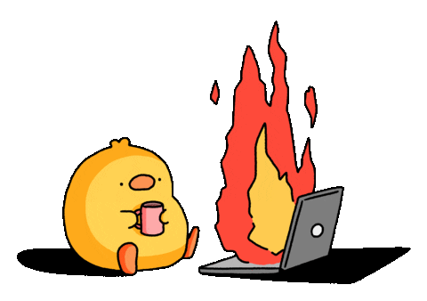
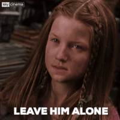
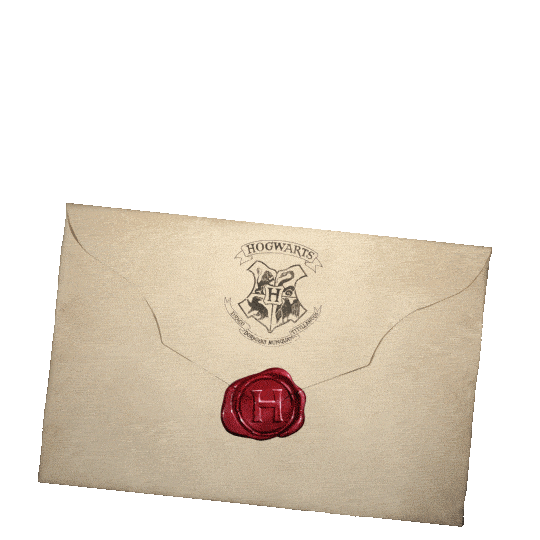
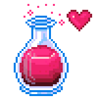
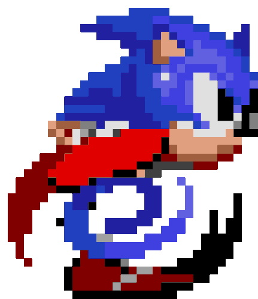
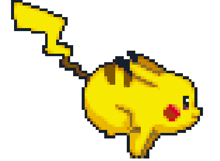

  

    <a href="https://github.com/DenverCoder1/readme-typing-svg">
        <picture>
            <!-- Dark Mode: Light ice-blue typing SVG -->
            <source media="(prefers-color-scheme: dark)" srcset="https://readme-typing-svg.demolab.com?font=Dancing+Script&weight=500&size=40&pause=1000&color=CAF0F8&center=true&vCenter=true&width=465&lines=Hello+%F0%9F%91%8B;Shubhanshu+this+side" />
            <!-- Light Mode: Dark teal/blue typing SVG -->
            <source media="(prefers-color-scheme: light)" srcset="https://readme-typing-svg.demolab.com?font=Dancing+Script&weight=500&size=40&pause=1000&color=0077B6&center=true&vCenter=true&width=465&lines=Hello+%F0%9F%91%8B;Shubhanshu+this+side" />
            
        </picture>
    </a>

<h3 align="center">Writing codes and stories</h3>

<table border="0">
  <tr>
    <td width="120" align="center" valign="middle">
      
    </td>
    <td valign="middle">
      I bridge the gap between storytelling and software engineering — writing immersive fiction by day and clean Python or Rust systems by night. Currently focused on open-source contributions and mastering low-level programming! 🦀🐍
    </td>
  </tr>
</table>

<table border="0">
  <tr>
    <td valign="middle">
      😮‍💨 <b>Honest Truth:</b> Some days, the code just wins. Whether I'm staring at a cryptic error for three hours or fixing one bug only to break four other things, tech can get exhausting. When I look completely done with my IDE, Genie steps in to guard my sanity until I recover!
    </td>
    <td width="120" align="center" valign="middle">
      
    </td>
  </tr>
</table>

<table border="0">
  <tr>
    <td width="110" align="center" valign="middle">
      
    </td>
    <td valign="middle">
      When the keyboard goes quiet, I'm usually immersed in single-player RPGs 🎮, bingeing seasonal anime 🍿, or running back classic Harry Potter chapters and pure Baba Yaga action <b>(iykyk)</b>.
    </td>
    <td width="110" align="center" valign="middle">
      
    </td>
  </tr>
</table>

<table border="0">
  <tr>
    <td width="110" align="center" valign="middle">
      
    </td>
    <td valign="middle">
      ✉️ Like any true Potterhead, I spent years waiting for my Hogwarts acceptance letter to arrive by owl 🦉. When it never showed up, I decided to craft my own magic here instead — turning ideas into software and stories! 🪄✨
    </td>
    <td width="110" align="center" valign="middle">
      
    </td>
  </tr>
</table>

<table border="0">
  <tr>
    <td valign="middle">
      💬 Want to discuss writing tips, anime recommendations, or collaborate on tech projects? Feel free to send an owl 🦉 over <a href="https://github.com/kshanxs/kshanxs/issues">to my GitHub issues page</a>! 📨
    </td>
    <td width="120" align="center" valign="middle">
      
    </td>
  </tr>
</table>

 

  

    "Imagination is more important than knowledge." - Albert Einstein
  

<h2 align="center">
    
    Dev Spellbook
    
</h2>
 

<table border="0" align="center">
  <tr>
    <td align="center" valign="middle">
      
    </td>
    <td width="140" align="center" valign="middle">
      
    </td>
  </tr>
</table>

<h2 align="center">
    
    Arcade
    
</h2>

<picture data-importer="pacman">
  <source media="(prefers-color-scheme: dark)" srcset="https://raw.githubusercontent.com/kshanxs/kshanxs/pacman-output/bomberman-contribution-graph-dark.svg?game=bomberman">
  <source media="(prefers-color-scheme: light)" srcset="https://raw.githubusercontent.com/kshanxs/kshanxs/pacman-output/bomberman-contribution-graph.svg?game=bomberman">
  
</picture>

<h2 align="center">
    
    私の道場 (My Dojo)
    
</h2>
 

  
  
  

 

<table border="0">
  <tr>
    <td width="150" align="center" valign="middle">
      
    </td>
    <td valign="middle">
      Thanks for stopping by! Words and code are our most inexhaustible source of magic — capable of building entire worlds out of thin air. Whether you're here to collaborate or just explore, feel free to reach out. Until next time, mischief managed! ⚡🪄
    </td>
  </tr>
</table>
