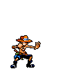
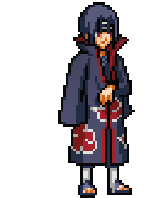
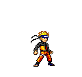
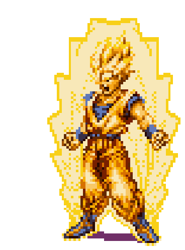

  

<h1 align="center">
    <a href="https://github.com/DenverCoder1/readme-typing-svg">
        <picture>
            <!-- Dark Mode: Light ice-blue typing SVG -->
            <source media="(prefers-color-scheme: dark)" srcset="https://readme-typing-svg.demolab.com?font=Dancing+Script&weight=500&size=40&pause=1000&color=CAF0F8&center=true&vCenter=true&width=465&lines=Hello+%F0%9F%91%8B%F0%9F%8F%BC;Shubhanshu+this+side" />
            <!-- Light Mode: Dark teal/blue typing SVG -->
            <source media="(prefers-color-scheme: light)" srcset="https://readme-typing-svg.demolab.com?font=Dancing+Script&weight=500&size=40&pause=1000&color=0077B6&center=true&vCenter=true&width=465&lines=Hello+%F0%9F%91%8B%F0%9F%8F%BC;Shubhanshu+this+side" />
            
        </picture>
    </a>
</h1>

    <h3>
        <!-- Sized consistently to 40x40 for symmetry -->
        
        Avidly learning and growing
        
    </h3>

  🔥 I'm dedicating time to level up myself, like a wizard mastering spells and a hitman perfecting his craft. 🔥
    
  🌱 And diving into **TypeScript, Docker,** and more right now! 🌊
    
  ✨ Crafting digital magic 🪄, turning caffeine ☕️ into clean & powerful code 💻, as precise as a Baba Yaga's aim.
    
  🪄 Fun fact: The first computer bug 🐛 was an actual bug, a moth 🦋 found in a Harvard Mark II computer in 1947, which caused a malfunction. This is how the term "debugging" originated!
    
  💬 Curious about **Python 🐍, React...** or anything else? Send an owl 🦉 [to my GitHub issues page](https://github.com/kshanxs/kshanxs/issues)! 📨

 

  

    "Imagination is more important than knowledge." - Albert Einstein
  

<h2 align="center">
    <!-- Balanced height/width to 80x80 and vertically aligned -->
    
    Dev Spellbook
    
</h2>
 

    

  <h2>🎮 Arcade 🎮</h2>
<picture data-importer="pacman">
  <source media="(prefers-color-scheme: dark)" srcset="https://raw.githubusercontent.com/kshanxs/kshanxs/pacman-output/bomberman-contribution-graph-dark.svg?game=bomberman">
  <source media="(prefers-color-scheme: light)" srcset="https://raw.githubusercontent.com/kshanxs/kshanxs/pacman-output/bomberman-contribution-graph.svg?game=bomberman">
  
</picture>

<h2 align="center">
    <!-- Sized symmetrically to 60x60 -->
    
    Code 次元 (Jigen)
    
</h2>
 

  
  
  

 

